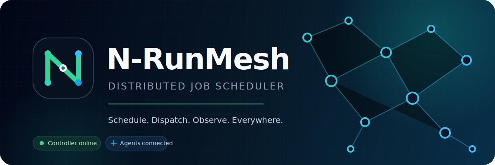

<p align="center">
  
</p>

<p align="center">
  
  
  
  
</p>

<p align="center">
  Self-hosted controller and secure agents for scheduling jobs across multiple machines.
</p>

## Controller quick start

Linux/macOS:

```bash
chmod +x deploy/controller/start.sh
./deploy/controller/start.sh
```

Windows:

```powershell
powershell.exe -ExecutionPolicy Bypass -File .\deploy\controller\start.ps1
```

On first start, the launcher creates `.env`, generates strong random secrets,
prints the initial admin password once, builds the images, and starts the
stack. Later runs preserve the existing configuration and database.

You can also copy `.env.example` to `.env` and run `docker compose up -d
--build` manually.

Open `http://localhost:3012` and sign in using `NRUNMESH_ADMIN_USER` and
`NRUNMESH_ADMIN_PASSWORD` from `.env`.

The controller stack contains:

- the N-RunMesh web controller;
- PostgreSQL 16 with a persistent Docker volume;
- database readiness and controller health checks;
- automatic schema creation and first-admin bootstrap.
- profile and password management;
- role-based users with category/job access assignment;
- online/offline agent monitoring;
- timezone, database test, backup, and restore administration.
- daily automatic PostgreSQL backups (09:00 by default), configurable host
  storage, retention, download, and one-click restore.

Agents communicate only through the Controller HTTP API. PostgreSQL is bound
to localhost by default and is never exposed to Agent machines.

The bootstrap creates the administrator only when it does not exist. Changing
`NRUNMESH_ADMIN_PASSWORD` later does not overwrite an existing account.

## Current layout

```text
N-RunMesh/
├── controller/          # web dashboard, API, and orchestration
├── agent/               # cross-platform job executor
└── deploy/
    ├── linux/install.sh
    └── windows/install.ps1
```

The public component names are **N-RunMesh Controller** and
**N-RunMesh Agent**.

## Agent installation modes

- **manual** installs an isolated Python virtual environment and a launcher.
  The user starts and stops the agent.
- **automatic** performs the same installation and registers the agent to
  start with the operating system.

Linux:

```bash
chmod +x nrunmesh-agent-0.2.0-linux-x86_64.sh
sudo ./nrunmesh-agent-0.2.0-linux-x86_64.sh
```

Windows setup wizard:

```powershell
.\N-RunMesh-Agent-Setup-0.2.0.exe
```

Both installers support interactive setup and command-line parameters. See
the installer help for unattended deployment.

Before installation, an administrator opens **Agents** in the Controller and
generates a one-time setup token. The user only pastes the Controller URL,
setup token, and optional Agent name. Python is installed automatically when
the operating system package manager supports it.

Unattended Linux example:

```bash
sudo ./nrunmesh-agent-0.2.0-linux-x86_64.sh \
  --mode automatic \
  --name worker-01 \
  --controller-url 'https://runmesh.example.com' \
  --setup-token 'nrm_setup_one_time_token' \
  --non-interactive
```

Unattended Windows example:

```powershell
.\deploy\windows\install.ps1 `
  -Mode automatic `
  -Name worker-01 `
  -ControllerUrl "https://runmesh.example.com" `
  -SetupToken "nrm_setup_one_time_token" `
  -NonInteractive
```

On Windows, automatic mode uses a built-in Scheduled Task running as
`SYSTEM`. A native Windows Service wrapper can replace this in a later
standalone-agent release.

## Official compiled Agent engine

The Agent execution engine is compiled from `agent/app/executor.py`:

- Linux releases contain `executor*.so`;
- Windows releases contain `executor*.pyd`;
- the Python scheduler source is excluded from release packages;
- the engine and verifier are covered by a signed Ed25519 manifest;
- the verifier embeds the official public key and rejects modified binaries.

Build the signed Linux package:

```powershell
.\deploy\build\build-agent-linux.ps1 -Version 0.2.0
```

Build the Windows package after installing Microsoft C++ Build Tools 14+:

```powershell
.\deploy\build\build-agent-windows.ps1 -Version 0.2.0
```

The private release-signing key lives under `.signing/` and must never be
committed or distributed. Agent setup uses a one-time token generated from the
Controller's Agents page. The token is exchanged for a unique machine
credential and cannot be reused.
